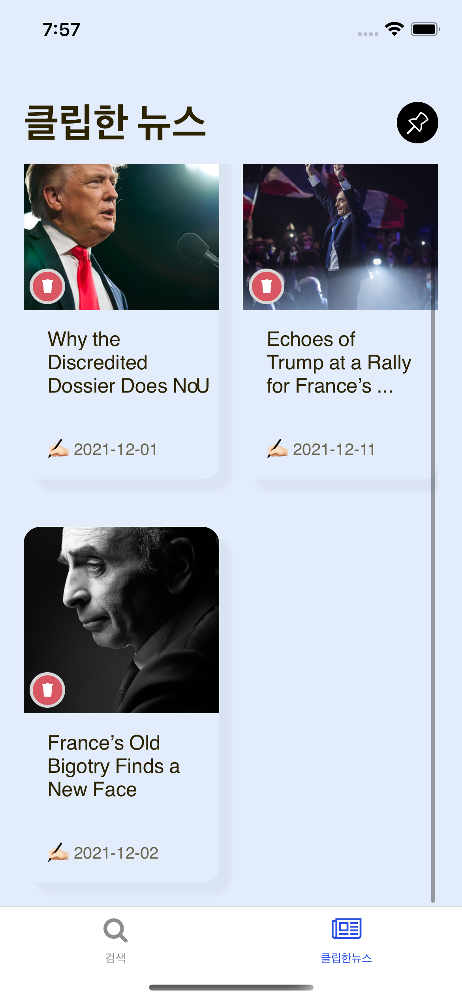

# 숨고 코딩 과제 👩🏻‍💻 - by 한지영

---

## Preview

<p align="center">
  
</p>
<p align="center">
  
</p>
<p align="center">
  
</p>
<p align="center">
  
</p>
<p align="center">
  
</p>
<p align="center">
  
</p>
<p align="center">
  
</p>
<p align="center">
  
</p>
<p align="center">
  
</p>
<p align="center">
  
</p>
<p align="center">
  
</p>

## Running this app

먼저 **package.json**의 모든 모듈을 다운로드합니다.

```
npm install
```

또는

```
yarn
```

을 프로젝트 폴더 내에서 실행합니다.

<br />

그리고 리액트 네이티브의 자바스크립트 번들러인 Metro를 시작해야 합니다.

이 앱은 expo로 만들어졌으므로 Metro를 시작하려면 프로젝트 폴더 내에서 **expo start** 명령을 실행하기만 하면 됩니다.

```
expo start
```

<br />

Metro 번들러 내부에서
**Run on Android device/emulator** 또는 **Run on iOS simulator**을 클릭합니다.

또는 간단히 명령어를 입력하여 시뮬레이터로 앱을 실행할 수 있습니다.

```
expo start --android
```

또는

```
expo start --ios
```

## Tools Used

- [x] Expo
- [x] React Redux
- [x] Redux Saga
- [x] Typescript
- [x] Async Storage
