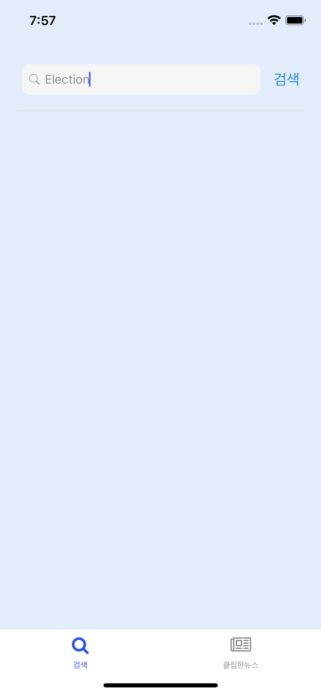

# Luko Tech Case Study 👩🏻‍💻 - by Jeeyoung Han

---

## Preview

<p align="center">
  
</p>
<p align="center">
  
</p>
<p align="center">
  
</p>
<p align="center">
  
</p>
<p align="center">
  
</p>
<p align="center">
  
</p>
<p align="center">
  
</p>
<p align="center">
  
</p>
<p align="center">
  
</p>
<p align="center">
  
</p>
<p align="center">
  
</p>

## Running this app

### - Running on your computer

First, download all modules in **package.json**.

```
npm install
```

or

```
yarn
```

And you will need to start Metro, the JavaScript bundler that ships with React Native.

To start Metro, simply run **expo start** command inside your React Native project folder:

```
expo start
```

and from the inside Metro bundler,
click **Run on Android device/emulator** or **Run on iOS simulator**.

Or you can simply type,

```
expo start --android
```

or

```
expo start --ios
```

to open and run the simulator.

That's it! :)

### - Running on your mobile device

- Download the Expo app on your Android or iOS device. It's available on the Google Play Store and on the iOS App Store.
- Within the Expo App type this link into the search bar or scan the QR code with your device at this link: https://expo.dev/@candicehan/luko-case-study-jeeyounghan

## Tools Used

- [x] Expo
- [x] React Redux
- [x] Redux Saga
- [x] Typescript
- [x] Async Storage
# luko-refactoring
# jeeyoungnews
